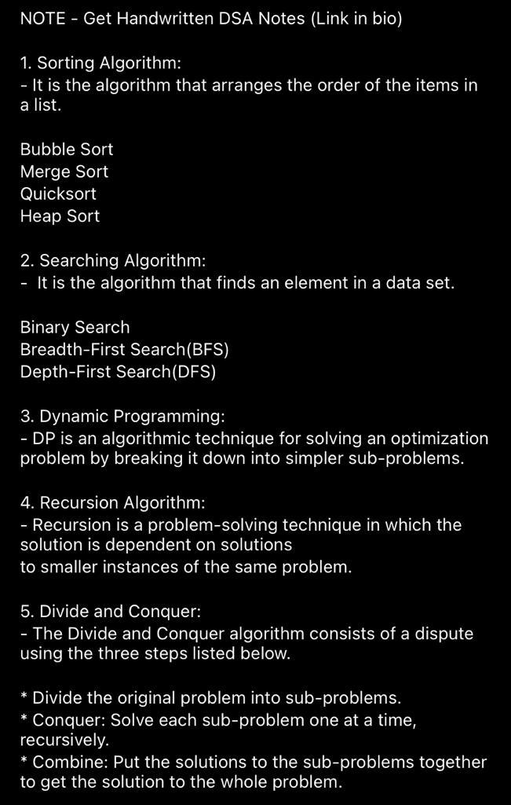
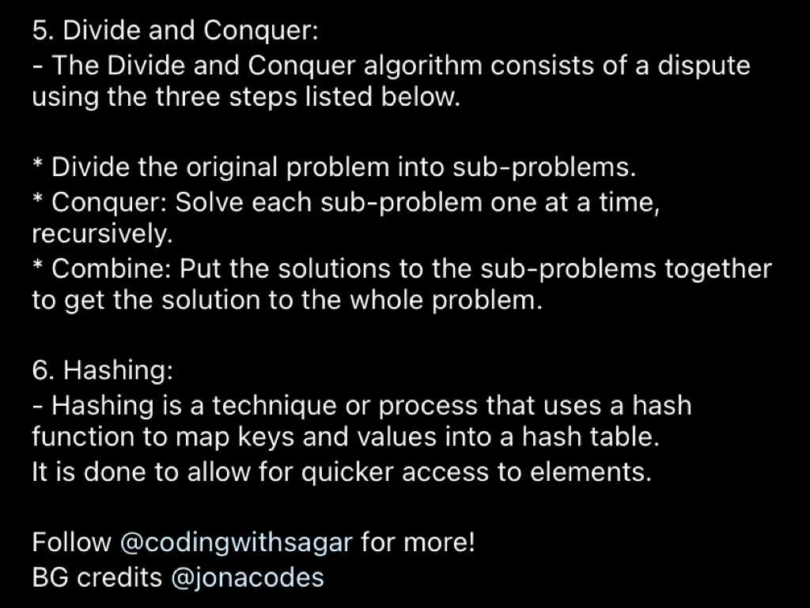
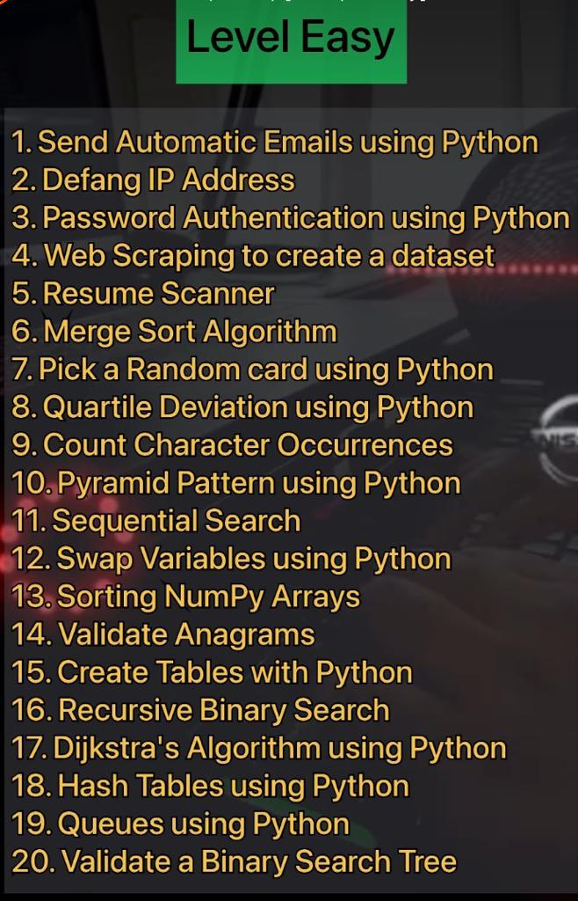
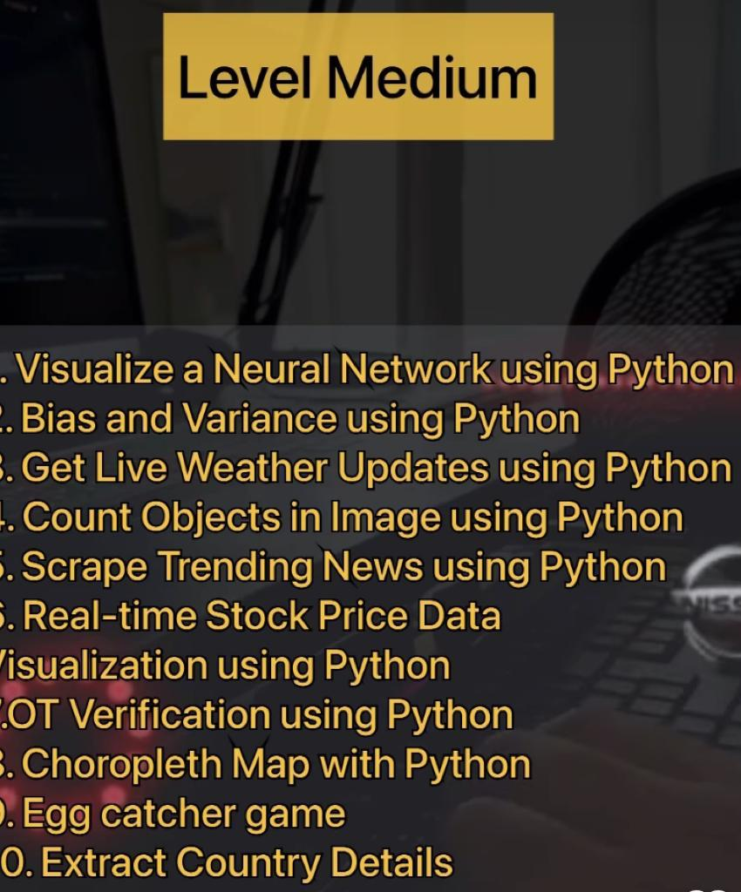
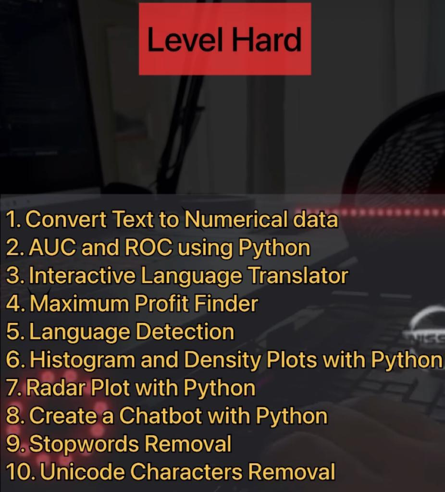

# To-Do list

* ~~Binary Search~~
* ~~Quick Sort~~
* ~~Merge Sort~~
* ~~Depth First Search~~
* ~~Breadth First Search~~
* ~~Dijkstra's Algorithm~~
* ~~A* Search Algorithm~~
* Dynamic Programming
* Fibonacci Sequence
* Longest Common Subsequence
* Binary Tree Traversals
* (Inorder, Preorder, Postorder)
* Heap Sort
* Knapsack Problem
* Flyod-Warshall Algorithm
* Union Find
* Topological Sort
* Kruskals Algorithm
* Prim's Algorithm
* Bellman-Ford Algorithm
* Rabin-Karp Algorithm
* Huffman Coding Compression
* Quickselect
* Kandane's Algorithm
* Flood Fill Algorithm
* Lee Algorithm

## Type Tags

* __FIXME__: this is a fix tag
* __TODO__: this is todo tag
* __IDEA__: This is an idea tag
* __CONCEPT__: this is a concept tag

## Status Tag

* __COMPLETE__: this is a complete tag
* __INPROGRESS__: this is an in progress tag  
* __REMOVED__: this is a removed tag
* __ONHOLD__: this is an on hold tag
* __CANCELLED__: this is a cancelled tag
* __REJECTED__: this is a rejected tag
* __NOFIX__: this is a no fix tag

The list is a list of TODO items broken into Spike, Game and Tools.

* __Spike__: means a lot of research is needed to look at the topic
* __Tools__: these are useful tools to work on games development with
* __Game__: these are essential items for the development of a game
* __CODE__: these are items that need to be fixed in the code

|Type|Code|Item|Status|Description|
|-----|----|----|------|----------------------------------------------------|
|TODO:|C001|CODE|COMPLETE|change mp3towav.py to check OS and only run in linux|
|TODO:|C002|CODE|COMPLETE|change mp3towav2.py to check OS and only run in linux|
|TODO:|C003|CODE|COMPLETE |change colconvert.py to to store the output in a folder (not the current one )|
|TODO:|C004|CODE|NOFIX |change phone.py to fix type|
|TODO:|C005|CODE|REMOVED|fix projectbuild.py|
|TODO:|C006|CODE|COMPLETE |fix sqllitexample.py |
|TODO:|C007|CODE|COMPLETE|fix everything in code/slack directory|
|TODO:|C008|CODE|COMPLETE|fix code/spotify/spotify.py|
|TODO:|C009|CODE| |TKBOIDS Add wind or current that "blows" the boids around|
|TODO:|C010|CODE| |TKBOIDS Have boids tend towards a place; travel through waypoints|
|TODO:|C011|CODE| |TKBOIDS Allow boids to "perch" on the ground at random.|
|TODO:|C012|CODE| |TKBOIDS Add a "flock" of boids that move together|
|TODO:|C013|CODE| |TKBOIDS ANTI-Flocking Behavior Get the boid group to scatter from each other; add more rules|
|TODO:|C014|CODE| |TKBOIDS ANTI-Flocking Send the boids away from certain areas; danger or obstacles|
|TODO:|C015|CODE| |TKBOIDS ANTI-Flocking Introduce predators that boids will always run from|
|TODO:|C016|CODE| |TKBOIDS Boids need to "see" each other|
|TODO:|C017|CODE| |TKBOIDS Unseen boids should be ignored|
|TODO:|C018|CODE| |TKBOIDS Refer to the original algorithm|
|TODO:|C019|CODE| |TKBOIDS [Source](http://www.red3d.com/cwr/boids/) |
|TODO:|C020|CODE| |TKBOIDS  Change updating system to that used by QuizMe|
|TODO:|C021|CODE| |Breadth First Search|
|TODO:|C022|CODE| |Depth First Search|
|TODO:|C023|CODE| |Movie Database API [Open Movie API](https://www.omdbapi.com/) [IMDB](https://developer.themoviedb.org/docs/getting-started)|
|TODO:|C024|CODE| |News Database API [News Api](https://newsapi.ai/?gad_source=1&gclid=Cj0KCQjwiOy1BhDCARIsADGvQnBoJ7cMqVzK-x_XIjIxbosadutIEmt4bKomgbldzV9uR869nYHJzJ4aAoWzEALw_wcB) |
|TODO:|C025|CODE| |PDF Processing API [ILovePDF API](https://www.ilovepdf.com/)|
|TODO:|C026|CODE| |Player Ranking systems |
|TODO:|C027|CODE| |MARVEL comics API [MARVEL Comics API](https://developer.marvel.com/) |
|TODO:|C028|CODE| |Football (soccer) API [API-Football](https://www.api-football.com/) |
|TODO:|C029|CODE| |NASA API [NASA API](https://api.nasa.gov/) |
|TODO:|C030|CODE| |Pokemon API [Poke API](https://pokeapi.co/docs/v2) |
|TODO:|C031|CODE| |Yahoo API [API](https://developer.yahoo.com/api/) |
|TODO:|C032|CODE| |Weather API [Open Weather API](https://openweathermap.org/api) |

## Other To-Do Items

* 
* 
* 
* 
* 
* [Data Science Projects](https://python.plainenglish.io/85-data-science-projects-c03c8750599e)
* [POstGres install](https://www.digitalocean.com/community/tutorials/how-to-install-and-use-postgresql-on-ubuntu-20-04)
* [Roguelike - reddit](https://www.reddit.com/r/roguelikedev/)
