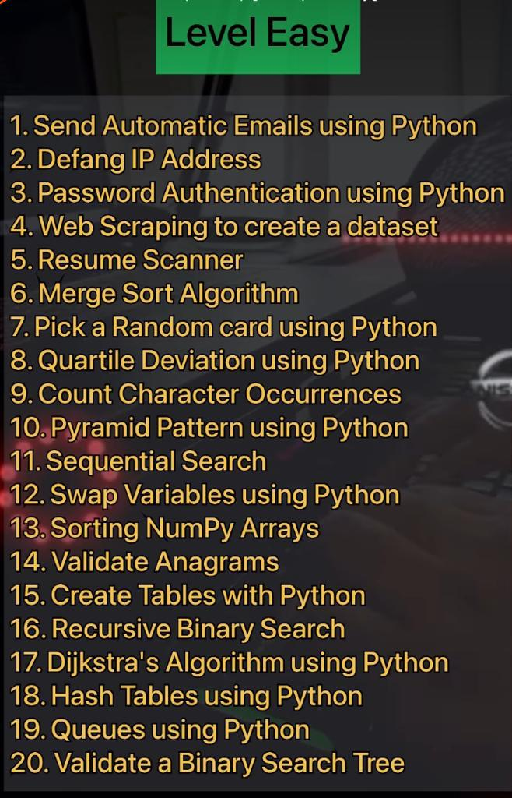

# To-Do list

## Tags

* `# FIXME: this is a Fix Tag`
* `# TODO: this is todo tag`
* `# IDEA: This is an idea tag`
* `# CONCEPT: this is a concept tag`

The list is a list of TODO items broken into Spike, Game and Tools.

* __Spike__: means a lot of research is needed to look at the topic
* __Tools__: these are useful tools to work on games development with
* __Game__: these are essential items for the development of a game
* __CODE__: these are items that need to be fixed in the code

|Status|Code|Item|Status|Description|
|----- |----|----|------|----------------------------------------------------|
|TODO:|C001|CODE|COMPLETE|change mp3towav.py to check OS and only run in linux|
|TODO:|C002|CODE|COMPLETE|change mp3towav2.py to check OS and only run in linux|
|TODO:|C003|CODE|COMPLETE |change colconvert.py to to store the output in a folder (not the current one )|
|TODO:|C004|CODE| |change phone.py to fix type|
|TODO:|C005|CODE|REMOVED|fix projectbuild.py|
|TODO:|C006|CODE|COMPLETE |fix sqllitexample.py |
|TODO:|C007|CODE| |fix everything in code/slack directory|
|TODO:|C008|CODE| |fix code/spotify/spotify.py|
|TODO:|C009|CODE| |TKBOIDS Add wind or current that "blows" the boids around|
|TODO:|C010|CODE| |TKBOIDS Have boids tend towards a place; travel through waypoints|
|TODO:|C011|CODE| |TKBOIDS Allow boids to "perch" on the ground at random.|
|TODO:|C012|CODE| |TKBOIDS Add a "flock" of boids that move together|
|TODO:|C013|CODE| |TKBOIDS ANTI-Flocking Behavior Get the boid group to scatter from each other; add more rules|
|TODO:|C014|CODE| |TKBOIDS ANTI-Flocking Send the boids away from certain areas; danger or obstacles|
|TODO:|C015|CODE| |TKBOIDS ANTI-Flocking Introduce predators that boids will always run from|
|TODO:|C016|CODE| |TKBOIDS Boids need to "see" each other|
|TODO:|C017|CODE| |TKBOIDS Unseen boids should be ignored|
|TODO:|C018|CODE| |TKBOIDS Refer to the original algorithm|
|TODO:|C019|CODE| |TKBOIDS http://www.red3d.com/cwr/boids/ |
|TODO:|C020|CODE| |TKBOIDS  Change updating system to that used by QuizMe|
|TODO:|C021|CODE| |Breadth First Search|
|TODO:|C022|CODE| |Depth First Search|

## Other To-Do Items

* 
* 
* 
* 
* 
* [Data Science Projects](https://python.plainenglish.io/85-data-science-projects-c03c8750599e)
* [POstGres install](https://www.digitalocean.com/community/tutorials/how-to-install-and-use-postgresql-on-ubuntu-20-04)
* [Roguelike - reddit](https://www.reddit.com/r/roguelikedev/)

