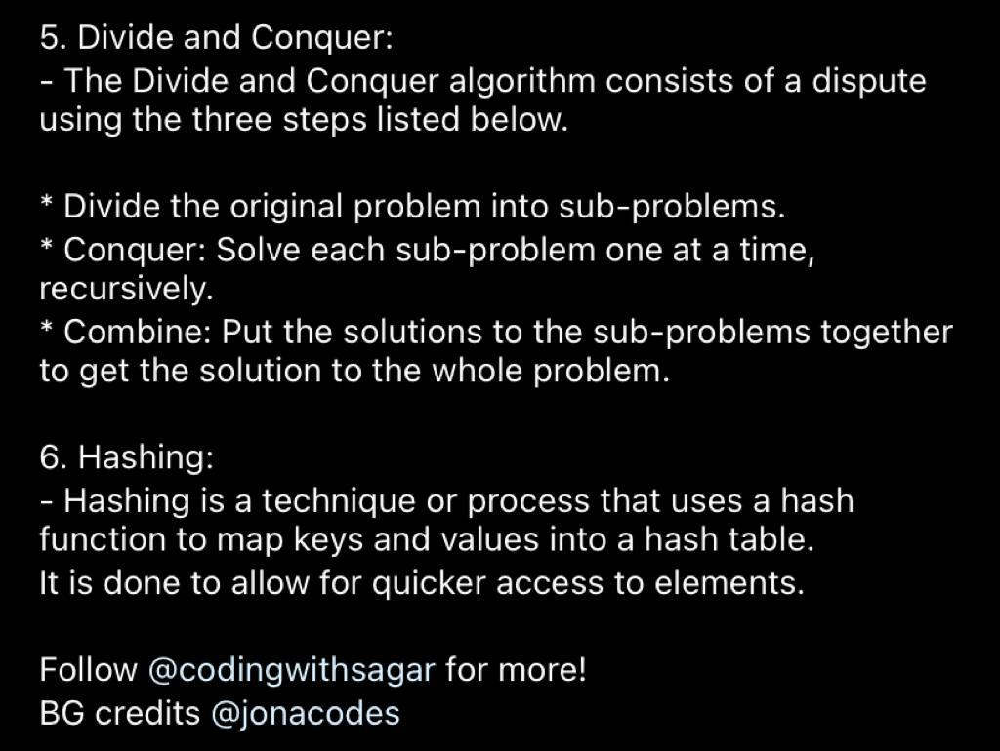

# To-Do list

* Binary search
* Breadth First Search
* Depth First Search

* 
* 
* 
* 
* 
* [Data Science Projects](https://python.plainenglish.io/85-data-science-projects-c03c8750599e)
* [POstGres install](https://www.digitalocean.com/community/tutorials/how-to-install-and-use-postgresql-on-ubuntu-20-04)
* [Roguelike - reddit](https://www.reddit.com/r/roguelikedev/)

## TAGS
`# FIXME: this is a Fix Tag`
`# TODO: this is todo tag`
`# IDEA: This is an idea tag`
`# CONCEPT: this is a concept tag`

## TKBoids

### TODO: further tweaks
2. Add wind or current that "blows" the boids around
3. Have boids tend towards a place; travel through waypoints
6. Allow boids to "perch" on the ground at random.

### TODO: anti-flocking behaviour
1. Get the boid group to scatter from each other; add more rules
2. Send the boids away from certain areas; danger or obstacles
3. Introduce predators that boids will always run from

### TODO: some other details
1. Boids need to "see" each other
2. Unseen boids should be ignored
3. Refer to the original algorithm
4. http://www.red3d.com/cwr/boids/
6. Change updating system to that used by QuizMe

## Information
* 'Y:/pyproject/resources/match3_tiles_px.png'
* 'Y:/pyproject/code/game/Shmup/img/p1_jump.png'
