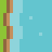
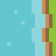
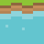

# Wargames Project - Notes

## Introduction 

This is a generic wargames project to build classes for handling wargames of all types.
For fantasy wargames we will use "Fantasy Waragming" by Martin Hackett as a reference.
We will base races and modifiers from the tables therin.

From a technical stand point we will use the following:

* Python to prototype the game.
* Pygame as the base game engine.
* Pygame GUI as the base GUI engine.
* Open Source assets for the game. These will be credited here and in the game.

## To Do

* Create a basic game engine.
* Create a basic GUI engine.
* Create a basic map engine.
* Create a basic tile engine.
* Build an editor for the map.
* Design the game map.
* source tiles and game tokens 
* map out the game play

## Classes

This will contain a list of the available classes and their purpose

* creature - This is the base class for all creatures in the game.
* gamemap - This is the base class for the game map.
* map - This is the base class for the map.
* spell - This is the base class for all spells in the game.
* tile - This is the base class for all tiles in the game.
* viewmap - This is the base class for the view map.
* worldmap - this is the base class for the worldmap 

## Screen Notes 

This is based on a tile which is 16 pixel wide and 16 pixels high.
You will need to calculate the number of tiles required for the screen size.
And readjust the number if the tiles are bigger than 16x16 pixels.

|Screen Width |Screen Height |Tile Width |Tile Height |Notes |
|----|----|----|----|----|
| 320 | 240 | 20 | 15 |Standard Game size |
| 480 | 320 | 30 | 20 |Standard Game size |
| 640 | 480 | 40 | 30 |Standard Game size |
| 800 | 640 | 50 | 40 |Standard Game size |
| 1024 | 768 | 64 | 48 |  |
| 1280 | 800 | 80 | 50 |  |
| 1600 | 800 | 100 | 50 |  |
| 1920 | 1072 | 120 | 67 |  |

## Map Notes

### Tile Notes

| Tile ID | Tile | Filename | Notes |
|----|----|----|----|
| 0 | GRASS_TILE_01 |  |  |
| 1 | GRASS_TILE_02 |  | |
| 2 | GRASS_TILE_03 |  | |
| 3 | DIRT_TILE_01 |  | |
| 4 | DIRT_TILE_02 |  | |
| 5 | SAND_TILE_01 |  | |
| 6 | SAND_TILE_02 |  | |
| 7 | STONE_TILE_01 |  | |
| 8 | STONE_TILE_02 |  | |
| 9 | STONE_TILE_03 |  | |
| 10 | WATER_TILE_01 |  | |
| 11 | WATER_TILE_02 |  | |
| 12 | WATER_TILE_03 |  | |
| 13 | WATER_BOTTOM |  | |
| 14 | WATER_BOTTOM_RIGHT |  | |
| 15 | WATER_BOTTOM_LEFT |  | |
| 16 | WATER_LEFT |  | |
| 17 | WATER_RIGHT |  | |
| 18 | WATER_TOP |  | |
| 19 | WATER_TOP_LEFT |  | |
| 20 | WATER_TOP_RIGHT |  | |

## Notes
